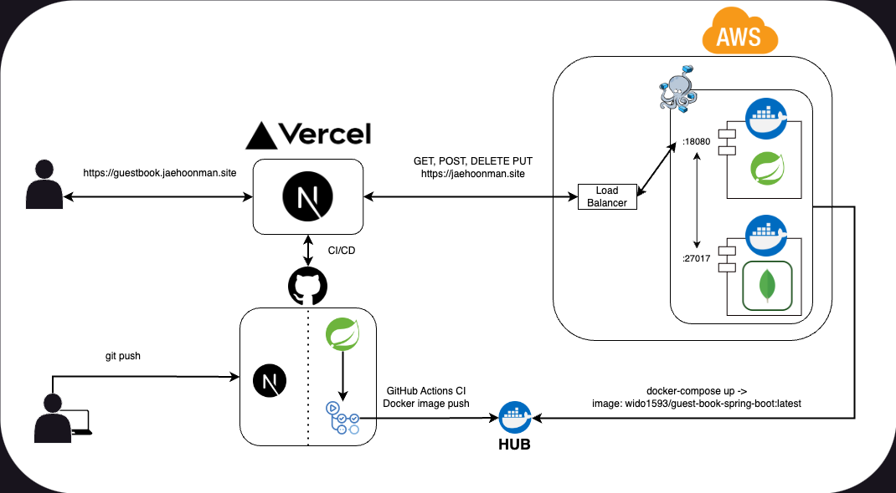

# 방명록 프로젝트 Backend By Spring Boot

---

## 프로젝트 정보
방문자가 방명록 데이터를 작성, 수정, 삭제, 검색, 정렬할 수 있는 기능을 가진 웹 애플리케이션.

## 구조, 구성

Server - Client 구성, Next.js로 구성된 Front와 REST API로 요청을 받는 Spring Boot Backend.

## 역할
Frontend에서 전달 받은 클라이언트의 요청을 처리하는 REST API.

## 특징
- Properties, 사용자 입력 데이터, DB 연결 정보 등 민감 정보 암호화.(JasyptConfig, GitHub Secret)
- GitHub Action을 통한 CI 구현
- Docker / Docker Compose로 Container화.
- MongoRepository의 기능을 확장하여 Query Method MongoDB연동.
- REST API로 HTTP METHOD에 따른 동작 수행.
- ~~(Front 학습에 치중하다보니 백엔드가 단순하다. 하하하)~~

## 주요 구조

### Contrller / Service
${host}/guestbook의 path로 들어온
- GET
- POST
- DELETE
- PUT  

의 HTTP Method를 Controller로 Mapping하여(GeustBookController.java) 각각의 로직을 타고 MongoDB와 Interative.

### Model / Repository
MongoRepository<> Interface 확장하여 JPA Repository에 DTO, DAO, VO로 활용될 수 있는 Model을 Mapping.

## 프로젝트 링크
- [재훈맨 방명록](https://guestbook.jaehoonman.site/)
- [Frontend 소스](https://github.com/jaehoonmandev/guest-book-nextjs)